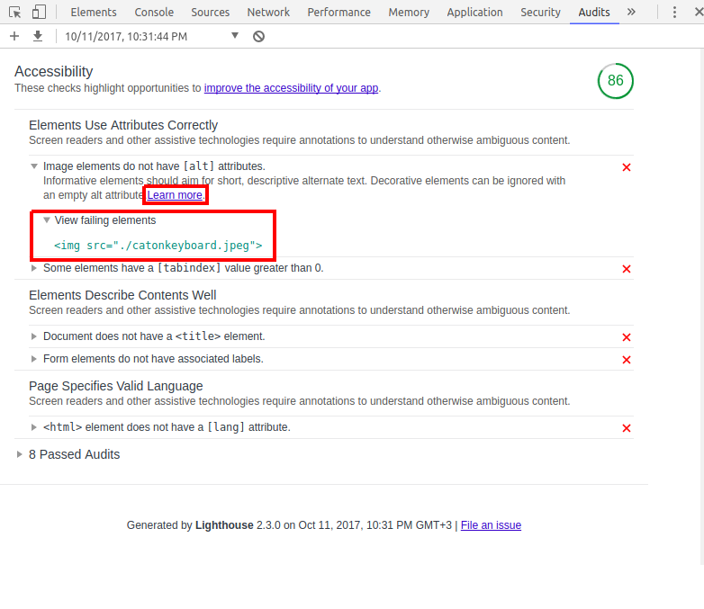

# Putting yourself in someone else's shoes

> Have you ever thought of the Internet as being "essential" or "a lifeline for many disabled people?" Think about it for a minute. There are certain things that people with disabilities simply cannot do for themselves. But, if they can use a computer connected to the world via the Internet, they have a high degree of independence. They can read the news, research areas of interest, purchase supplies, and access the world—at least potentially. They are independent as long as the sites that they want to access are designed to permit disability access.

from a WebAIM [article](http://webaim.org/articles/motor/)

+ [Perspectives](#different-perspectives)
+ [Stats](#some-statistics)
+ [Exercises](#exercises)
+ [Tools that can help](tools-that-can-help)
  + [What these tools check for](#what-these-tools-check-for)

## Why should we car

## Different Perspectives
How would you use your computer if your mouse was broken? probably you would try to fix it immediately, but have you ever wondered how people with physical disability use the computer?
Being able to navigate websites using a keyboard because of temporarily or a permanent disability or simply because of a broken mouse is 1 of 10 different perspectives you mostly haven't seen web applications through them before.
Check this video to see [The 10 Different Web Accessibility Perspectives ](https://www.youtube.com/watch?v=3f31oufqFSM).

## Some statistics
The following stats are taken from WHO (World Health Organisation) [research](http://www.who.int/mediacentre/factsheets/fs282/en/):

> About 90% of people with the disabilities in the list above, live in the developing world.

Even if we hear about the number of people who experience these disabilities, developers often mistakenly believe that these people aren't within their own userbase.

> 285 million people are visually impaired worldwide

That's nearly 4 times the population size of the UK and Israel combined

> 39 million of these are [blind](http://webaim.org/articles/visual/blind)

>   + 82% of blind people are over 50 years old

This age group constitutes 20% of the world, and many developing countries have an aging population

> 246 million have [low vision](http://webaim.org/articles/visual/lowvision)

> 360 million suffer from [hearing loss](http://webaim.org/articles/auditory/)

### Exercises
Think about your own website. Have you written it under the assumption that your users will be accessing your content with a mouse? Have you been relying on colour to convey meaning? Did you think about captions or transcripts for your audio content?

**Pair up with someone new, preferably someone whose website you haven't seen before.**

Open up your neighbour's website.

1. Try accessing every piece of content on the site using only your keyboard.

2. Download the [HTML 5 outliner](https://chrome.google.com/webstore/detail/html5-outliner/afoibpobokebhgfnknfndkgemglggomo?hl=en) chrome extension. Then go back to the website and click on the new icon in your toolbar.

  + Is the content semantic?
  + Screen reader users navigate the page based on the order of the elements in the DOM. Does the order look sensible?

3. Put in your earphones. Then download the [ChromeVox](https://chrome.google.com/webstore/detail/chromevox/kgejglhpjiefppelpmljglcjbhoiplfn?hl=en) chrome extension. Don't go back to your neighbour's website yet!
  + Go to [www.gov.uk](https://www.gov.uk/) and try navigating around, using only your keyboard, until you feel comfortable with the functionality of ChromeVox  
  To learn the necessary keyboard shortcuts, find ChromVox in your extensions and click on "Options"  
  
  + Click on the tab/window that contains your neighbour's website
  + Close your eyes! Then try navigating the site using only ChromeVox to help you. Can you get to all the content?  

  Note: You can disable the voice by clicking `Ctrl`, or disable ChromeVox altogether with `ctrl`+`alt`+`z` (or going to Settings -> Extensions, find ChromeVox and tick the "disable" checkbox).  

4. Try this again with someone else's website.

5. Install [Accessibility Developer Tools](https://chrome.google.com/webstore/detail/accessibility-developer-t/fpkknkljclfencbdbgkenhalefipecmb?hl=en)  
  + Run an audit on your neighbour's website:  
    1. Open dev tools (as normal)  
    2. Click on the new "Audit" tab
    3. Click Perform an audit
    

    4. Check the "Accessibility" box
    5. Click Run  
    

  + Use the clickable links to find out what the problems are and what can be done about them, and view failing elements to know where there problems are in the code.
  
  + Raise an issue on your neighbour's website for each newly discovered problem

6. Head to your own website, have a look at the issues, and start fixing bugs! :bug:

[More tools that can help](./tools-that-can-help.md)
